<!-- assets generated by build_assets.py (Relic Interface System, skin cyber) -->

  

**I build private agent systems.** The model is the easy part; my work is the harness around it: memory that survives the session, retrieval that cites its sources, and governance you can actually inspect. Local-first where the data is personal, cloud where it isn't.

The book, [*Private Agent Systems*](https://www.amazon.com/dp/B0H4RQMJG3), is out on Amazon. It treats agents as production software, not prompt experiments. The code is here: **Relic** models who you are over time, so a reflective agent can carry your context forward without pretending to be you, while **Amber** answers over large document collections by fusing vector search with knowledge-graph reasoning. **Relic Interface System** provides the brutalist tactical HUD and telemetry design system, and **session-handoff** migrates active agent sessions between Claude Code and Codex.

  

  
  
  
  
  

  
  
  
  

  

